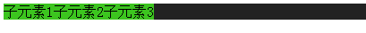
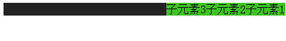
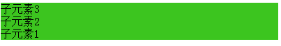
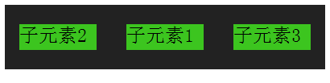

## flex布局实践

最近读了阮一峰大大的2篇关于flex布局的<a href="http://www.ruanyifeng.com/blog/2015/07/flex-grammar.html?utm_source=tuicool">语法篇</a>和<a href="http://www.ruanyifeng.com/blog/2015/07/flex-examples.html?bsh_bid=683103006">实例篇</a>,决定亲自试一试用flex来进行布局,使用下flex布局中的各个属性

##基本用法
父元素添加`display:flex`子元素都在一行显示，宽度与内联元素显示类似
```     
     <style>
		.parent{
			background-color: #222;

			display: flex;
			

		}
		.parent div{
			background-color: #3cc51f;
		}
	</style>


	<div class="parent">
	<div class="child1">子元素1</div>
	<div class="child2">子元素2</div>
	<div class="child3">子元素3</div>
	</div>
```



父元素用`flex-direction`决定排列方向
```
	 flex-direction: row | row-reverse | column | column-reverse;
```

`flex-direction:row`
	
`flex-direction:row-reverse`
	
`flex-direction:column`
	
`flex-direction:column-reverse`
	


`flex-wrap`决定在子元素放不下的时候是否换行,默认是不换行
` flex-wrap: nowrap | wrap | wrap-reverse;`
展示下换行的情况`flex-wrap:wrap`
	


`flex-flow`是`flex-direction`和`flex-wrap`的简写形式
` flex-flow: <flex-direction> || <flex-wrap>;`


`justify-content`主轴对齐内容的方式
` justify-content: flex-start | flex-end | center | space-between | space-around;`

如常用的中间对齐`justify-content:center`
	

空隙均匀分配`justify-content:space-around`
	

`align-items`次轴对齐内容的方式
`  align-items: flex-start | flex-end | center | baseline | stretch;`
例如`align-item:center`
	

底部对齐 `align-item:flex-end`
	

`align-content`多行的时候次轴对齐内容的方式，这里就不举例了，参照`align-items`


上面的是定义在父元素上的css属性，下面介绍下定义在子元素上的属性

`order`用数字定义排列顺序，默认是0

这里我把子元素2的顺序定义为-1，看是否会排到最前面,如下图
	

`flex-grow`定义子元的放大比例，默认为0（不放大）
这里我试试把子元素2的放大比例设置为1，看看会发生什么情况，如下图,子元素2
	占据了剩下的所有空间，空隙没有了
	


`flex-shrink`定义子元素的缩小比例，默认为1（空间不足时都要缩小，这是弹性布局很重要的一个特点，设置为0，则这个元素不会缩小）


`flex-basis`定义子元素占据的主轴空间，默认为`auto`,即子元素本身大小

flex属性是flex-grow, flex-shrink 和 flex-basis的简写

`  flex: none | [ <'flex-grow'> <'flex-shrink'>? || <'flex-basis'> ]`

该属性有两个快捷值：auto (1 1 auto) 和 none (0 0 auto),设置为auto为自适应，
	设置为none则基本不受弹性布局影响，不会放大或缩小


`align-self`允许子元素设置自己的次轴对齐方式
` align-self: auto | flex-start | flex-end | center | baseline | stretch;`
这里我让总体向上对齐，子元素二单独向下对齐`align-self:flex-end`
	

flex布局的属性基本实践了一遍，具体可以去看<a href="http://www.ruanyifeng.com/blog/2015/07/flex-grammar.html?utm_source=tuicool">阮一峰大大的博客</a>

